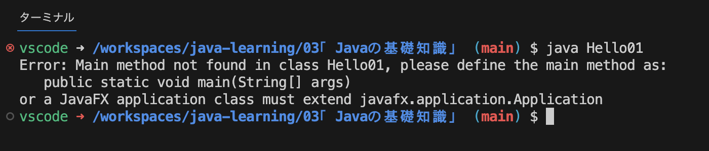

# Javaの基礎知識

- [クラス、メソッド、フィールド](#クラスメソッドフィールド)
  - [クラス](#クラス)
  - [メソッド](#メソッド)
  - [フィールド](#フィールド)
- [mainメソッドとは](#mainメソッドとは)
  - [mainメソッドの書式](#mainメソッドの書式)
- [System.out.printlnを紐解く](#systemoutprintlnを紐解く)
  - [Systemとは](#systemとは)
  - [System.outとは](#systemoutとは)
  - [System.out.printlnとは](#systemoutprintlnとは)
- [importの使い方](#importの使い方)
  - [同パッケージ内のクラスを複数利用する際の記述方法](#同パッケージ内のクラスを複数利用する際の記述方法)
  - [java.langパッケージの例外](#javalangパッケージの例外)


## クラス、メソッド、フィールド
Javaを使ったプログラミングを開始するうえでクラス、メソッド、フィールドがどういったものなのか簡単に学習。

### クラス
Javaなどのオブジェクト指向[^1]と呼ばれるプログラミング言語の基本となるもので、特定の目的を達成するのに必要なものを集めたもの。クラスの定義は下記の様に記述する。
```
修飾子 class クラス名 {
  // ここにメソッドやフィールドを定義
}
```
修飾子[^2]

例：電卓の様な機能を提供するクラス
```
class Dentaku {
  public static void main(String[] args) {
    Dentaku dentaku = new Dentaku();
    dentaku.plus(10, 5);
    dentaku.minus(9, 2);
  }

  // 足し算を行うメソッド
  void plus(int val1, int val2) {
    System.out.println(val1 + val2);
  }

  // 引き算を行うメソッド
  void minus(int val1, int val2) {
    System.out.println(val1 - val2);
  }
}
```

### メソッド
クラスの中で特定の処理を行うために必要なプログラムをまとめたもの。  
メソッドの定義は下記の様に記述する。
```
修飾子 class クラス名 {
  修飾子 戻り値のデータ型 メソッド名(仮引数の型 仮引数名) {
    // 処理を記述
  }

  // 戻り値が無いメソッド
  修飾子 void メソッド名(仮引数の型 仮引数名) {
    // 処理を記述
  }
}
```
仮引数[^3]

例：挨拶を行うロボットクラス
```
class GreetRobot {
  public static void main(String[] args) {
    GreetRobot greetRobot = new GreetRobot();
    greetRobot.greeting("Hello");
    greetRobot.greeting("Bye");
  }

  // 挨拶(引数の文字列)を表示するメソッド
  void greeting(String msg) {
    System.out.println(msg);
  }
}
```

### フィールド
クラスの中でデータの値を保管するために使用するもの。フィールドの定義は下記の様に記述する。
```
修飾子 class クラス名 {
  データ型 フィールド名;
}
```
例：前進と現在位置を表示する事が出来るロボットクラス
```
class MoveForwardRobot {
  // 現在位置を保管するためのフィールド
  int currentPosition = 0;

  public static void main(String[] arg) {
    MoveForwardRobot moveForwardRobot = new MoveForwardRobot();
    moveForwardRobot.report(); // 「Current Position = 0」が表示
    moveForwardRobot.moveForward();
    moveForwardRobot.report(); // 「Current Position = 1」が表示
  }

  // 現在位置を表示するメソッド
  void report() {
    System.out.println("Current Position = " + currentPosition);
  }

  // 前進するメソッド
  void moveForward() {
    currentPosition = currentPosition + 1;
  }
}
```

## mainメソッドとは
実行のプログラムを実行した際に最初に呼び出される特殊なメソッド、エントリーポイントとも呼ばれる。  
クラスの中にmainメソッドが無い場合コンパイルエラーにはならないが、プログラムを実行した際に下記の様なエラーとなる。

実行するクラスには必ずmainメソッドが必要となる。

### mainメソッドの書式
```
class クラス名 {
  public static void main (String[] args) {
    // ...
  }
}
```
mainメソッドには通常のメソッドとは異なり、書式にルールが存在する。
- アクセス修飾子はpublic[^4]である
- staticメソッドである(後述)
- メソッドの戻り値の型はvoid(戻り値無し)である
- メソッド名は“main”である(すべて小文字)
- メソッドの仮引数の型は、Stringの配列(あるいはStringの可変長引数)のみである  
※仮引数の変数名は何でもよいが、引数を意味する英単語「arguments」を省略した「args」がよく使われる。

staticメソッドはクラスメソッドとも呼ばれ、このメソッドがクラスから作成したオブジェクトのメンバーではなく、クラスそのもののメンバーであることを宣言している。  
これは、インスタンス[^5]から呼び出す事が出来ず、クラスから直接呼び出すことができるメソッドである事を意味する。

## System.out.printlnを紐解く

### Systemとは
Javaではクラスを利用してプログラミングを行い、そのクラスは自分で定義する事もあらかじめ用意されたクラスを利用する事も出来る。  
Systemはあらかじめ用意されたクラスの一つであり、java.langパッケージ[^6]に含まれている。  
目的のクラスを利用する際にそのクラスが含まれているパッケージをインポートする必要があるが、java.langパッケージは例外で最初からインポートされた状態の為、宣言無しで利用が出来る。

### System.outとは
Systemクラスのフィールドの一つで、標準出力する際に使用する。データ型はPrintStreamクラス。  
PrintStreamクラスには引数のデータ型毎にprintlnメソッドが用意されており、printlnメソッドを使用すると指定した値を出力する。

### System.out.printlnとは
前述の結果として、System.out.printlnは標準出力[^7]に対して指定した値を出力するためのメソッドという事になる。

## importの使い方
Javaではあらかじめ用意されたクラスを自分のプログラムの中で使用するには完全修飾子[^8]を記述して使用することも出来るが、import宣言を行なっておくことでクラス名だけの記述で済む。  
クラス名だけの事を単純名と呼び、クラスを利用する際はimport宣言と単純名で利用する事が一般的である。

例1：import宣言によるLocalDateクラス[^9]の利用
```
import java.time.LocalDate; //import宣言

class JSample9_1 {
  public static void main (String[] args) {
    // 単純名でLocalDateクラスのnowメソッドを利用
    LocalDate ld = LocalDate.now();
    System.out.println(ld);
  }
}
```

例2：完全修飾子を使用したLocalDateクラスの利用
```
class JSample9_2 {
  public static void main (String[] args) {
    // 完全修飾子でLocalDateクラスのnowメソッドを利用
    java.time.LocalDate ld = java.time.LocalDate.now();
    System.out.println(ld);
  }
}
```

### 同パッケージ内のクラスを複数利用する際の記述方法
例：java.utilパッケージ内に含まれる全てのクラスのimport宣言
```
import java.util.*;
```
なお上記の場合、java.utilパッケージ内のクラスは単純名で利用可能だが、下層パッケージであるjava.util.regexパッケージ内のクラスは単純名で利用できないので注意。

### java.langパッケージの例外
前述だが、StringクラスやSystemクラスなど、java.langパッケージに含まれているクラスはimport宣言の必要がない。  
java.lang.Stringやjava.lang1.Systemのように完全修飾子を記述する必要もない。


[^1]: 「ある役割を持ったモノ」ごとにクラスを分割し、モノとモノとの関係性を定義していく事でシステムを作り上げようとするシステム構成の考え方。
[^2]: アクセスの範囲を限定するもの。「public」「private」「protected」「修飾子無し」の4パターンがある。
[^3]: プログラム中で関数やメソッドを呼び出して実行する際、関数側で値を受け取るために宣言された変数。必要ない場合省略可。
[^4]: そのメソッドが全てのクラスからアクセス可能な事を宣言している。
[^5]: クラスを元に生成されたオブジェクト。クラスを設計書とするとインスタンスはそれを元に作られた実体。オブジェクト指向プログラミング言語にとって重要な要素である。
[^6]: Javaのクラスをを目的に合わせてグループ化した単位。
[^7]: プログラムから何かしらを出力するときに使用される出力先の事。例として、コマンドプロンプトからプログラムを実行している場合の標準出力はコマンドプロンプトの画面となる。
[^8]: 「java.util.regex.Pattern」といった正式なクラス名称の事。パッケージを含めたクラス名の事。
[^9]: 日付の情報を扱うクラス
[^10]: 正規表現を扱うクラスが揃うパッケージ