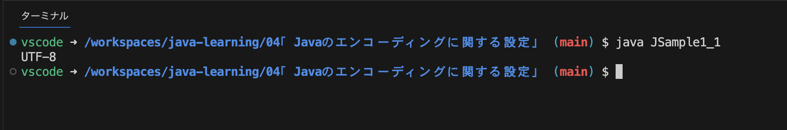

# Javaのエンコーディングに関する設定

- [デフォルトエンコーディングの確認](#デフォルトエンコーディングの確認)
- [エンコーディングを指定してコンパイルする](#エンコーディングを指定してコンパイルする)
- [エンコーディングを指定してプログラムを実行する](#エンコーディングを指定してプログラムを実行する)

エンコーディングとはデータを一定の規則に従って目的の情報に変換すること。日本語では符号化と呼ばれる。  
変換方式には種類があり、それらをエンコードの種類、または文字コードと言う。  

Javaでは内部的にはUnicodeという文字コードを利用してるが。コンパイルや出力を行うときにはfile.encodingプロパティに設定されたエンコーディングが使用されるものとして処理される。 

例1：コンパイル時
  1. ソースファイルのエンコーディングがfile.encodingプロパティのエンコーディングで記述されているものとして読み込む
  2. Unicodeに変換  

例2：プログラムから出力時
  1. Unicode からfile.encodingプロパティのエンコーディングに変換
  2. 出力

file.encodingプロパティに設定されているエンコーディングは環境によって異なり、ソースファイルを保存する際、file.encodingプロパティと同じエンコーディングが使用されていれば問題はない。  
しかし、別のエンコーディングが使用されている場合は別途設定が必要になる。

## デフォルトエンコーディングの確認
JavaをWindows環境で利用している場合、デフォルトエンコーディングは「MS932(Shift_JISの拡張版)」、
Mac環境のデフォルトエンコーディングは「UTF-8」となっている。  
SystemクラスのgetPropertyメソッドの引数に"file.encoding"を指定して実行すれば、エンコーディングが出力される。
```
// デフォルトエンコーディングを確認
class JSample1_1 {
  public static void main (String[] args) {
    System.out.println(System.getProperty("file.encoding"));
  }
}
```
エンコーディングの出力結果（Mac環境）


## エンコーディングを指定してコンパイルする
コンパイルを行う時にエンコーディングを指定するにはjavacの-encodingオプションを使用する。  
エンコーディング名にはソースファイルを保存した時のエンコーディングを指定。
```
javac -encoding エンコーディング名 ソースファイル名.java
// または
javac -J-Dfile.encoding=エンコーディング名 ソースファイル名.java
```

## エンコーディングを指定してプログラムを実行する
出力先の環境がデフォルトエンコーディングとは異なるエンコーディングが使用されている場合には、使用するエンコーディングを指定する必要がある。  
Javaのプログラムを実行する際にJavaの「-D<name>=<value>」オプションを利用して、file.encodingプロパティに別のエンコーディングを設定する。
```
java -Dfile.encoding=エンコーディング名 クラスファイル名
```
エンコーディング名にはプログラムを実行している環境で使用しているエンコーディングを指定する。