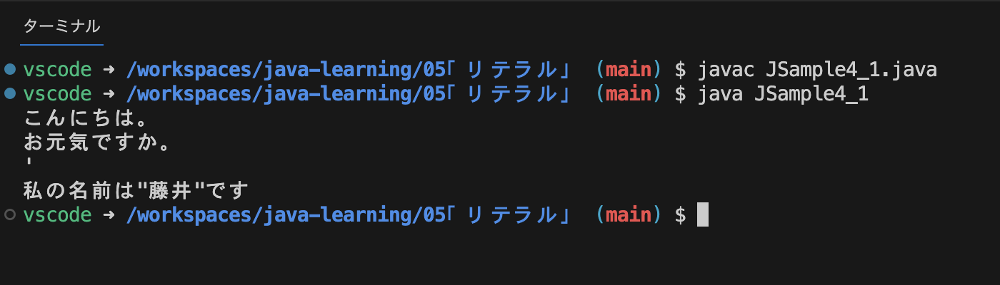
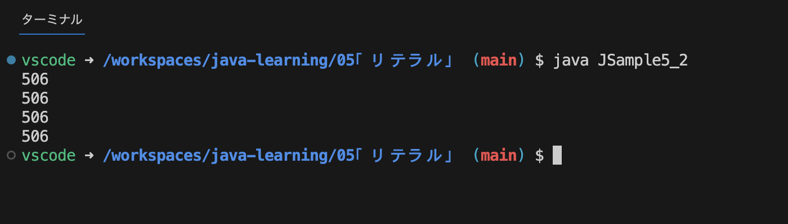

# リテラル
Javaにおけるリテラルとは文字や数値といった値そのもののことで、リテラルには文字リテラルや文字列リテラル、数値リテラルなどがある。

- [文字リテラル](#文字リテラル)
  - [文字コードを使った文字リテラルの表現](#文字コードを使った文字リテラルの表現)
- [文字列リテラル](#文字列リテラル)
- [エスケープシーケンスを使った特殊な文字の表現](#エスケープシーケンスを使った特殊な文字の表現)
- [整数リテラル](#整数リテラル)
- [浮動小数点数リテラル](#浮動小数点数リテラル)
- [サフィックス](#サフィックス)
  - [整数リテラルのサフィックス](#整数リテラルのサフィックス)
  - [浮動小数点数リテラルのサフィックス](#浮動小数点数リテラルのサフィックス)
- [理論値リテラル](#理論値リテラル)

## 文字リテラル
文字リテラルは1文字のリテラル。複数の文字が含まれている場合はエラーとなる。  
画面に出力したり、char型の変数に代入できる。
```
'a'
'あ'

'ab' //エラー
'筋肉' //エラー

'' //空の文字もエラー

System.out.println('a'); //画面に出力
char c = '猫'; //char型の変数cに代入
```

### 文字コードを使った文字リテラルの表現
文字リテラルの代わりに、Javaで利用されるUnicode(UTF-16)の文字コードを記述する事ができる。 
```
// 2つの文は同じ
char c1 = 'a';
char c2 = 0x0061;
```

ただし、画面出力するような場合に直接文字コードを記述すると数値として扱われてしまう為、エスケープシーケンスと呼ばれる特殊な文字列形式('\uxxxx')で表す必要がある。
```
System.out.println('a');      //aと出力
System.out.println(0x0061);   //97と出力
System.out.println('\u0061'); //aと出力（エスケープシーケンス）
```

## 文字列リテラル
複数の文字からなる値で、画面にメッセージを表示するときなどに使用する頻度が高いリテラル。Javaではダブルクォーテーションで表現する。  
画面に表示したり、Stringクラスの変数に代入する事ができる。
```
"こんにちは"
"Hello"
"猫"　//1文字でもOK
""　　//空文字でもOK

System.out.println("Hello"); //Helloと出力
String str = "こんにちは";     //String型の変数strに代入
```

## エスケープシーケンスを使った特殊な文字の表現
エスケープシーケンスはタブや改行といったキーボードから入力できない特種な文字を表現するための方法。
Javaで利用可能なエスケープシーケンスは次の様なものがある。

|表現 | 意味 |
| --- | --- |
| `\b` | バックスペース |
| `\t` | 水平タブ |
| `\n` | 改行 |
| `\r` | キャリッジリターン（復帰）[^1] |
| `\f` | 改ページ |
| `\'` | シングルクォーテーション |
| `\"` | ダブルクォーテーション |
| `\\` | \文字 |
| `\ooo` | 8進数の文字コードが表す文字 |
| `\uhhhh` | 16進数の文字コードが表す文字 |

利用例
```
class JSample4_1 {
  public static void main (String[] args) {
    // 改行
    // System.out.println("こんにちは。 ←エラー
    // お元気ですか。");
    System.out.println("こんにちは。\nお元気ですか。");

    // シングルクォーテーション
    // char c = '''; ←エラー
    char c = '\'';
    System.out.println(c);

    // ダブルクォーテーション
    // String str = "私の名前は"藤井"です"; ←エラー
    String str = "私の名前は\"藤井\"です";
    System.out.println(str);
  }
}
```

出力結果


## 整数リテラル
Javaではそのまま数値を記述すれば良い。  
10進数だけでなく、2進数、8進数、16進数でむ記述が可能。下記は全て`506`の値を表す。
```
506         //10進数
0b111111010 //2進数
0772        //8進数
0x1fa       //16進数
```
10進数と区別がつくよう、2進数では先頭に`0b`または`0B`、8進数では先頭に`0`、16進数では`0x`または`0X`を付ける。

| n進数 | 先頭 |
| --- | --- |
| 2進数 | `0b` or `0B` |
| 8進数 | `0` |
| 16進数 | `0x` or `0X` |

8進数や16進数で記述しても違いはなく、画面に出力すると10進数に変換されて出力される。


整数リテラルは計算を行ったり、int型の変数に代入する事ができる。  
整数であってもダブルクォーテーションで囲ってしまうと文字列リテラルとなり、計算を行う事が出来なくなるので注意。
```
int i1 = 1
int i2 = 2
System.out.println(i1 + n2); //3が出力される
```

## 浮動小数点数リテラル
小数点以下の部部を持つ実数の値。  
Javaでは整数部分と少数部分をピリオドを使って次の様に表す。
```
12.5
3.1415
```
また指数表現[^2]でも表す事ができる。10の何乗で表現する場合は`e`または`E`を使う。  
```
[仮数部]e[符号][指数部]
```
実際には次の様になる
```
5.23e3  //5.23 * 10^2 = 5230
2.172E-4  //2.172 * 10^-4 = 0.0002172
```

浮動小数点数リテラルは計算を行ったり、double型の変数に代入する事ができる。  
整数リテラルと同じでダブルクォーテーションで囲ってしまうと文字列リテラルとなり、計算ができなくなるので注意。
```
double d1 = 3.14;
double d2 = 3.14;
System.out.println(d1 + d2); //6.28が出力される
```

## サフィックス
特に何も指定しない場合、整数リテラルは`int型`の値、浮動小数点数リテラルは`double型`の値として扱われる。  
その為、例えば`int型`の範囲[^3]を超えた数値を整数リテラルとして記述してしまうとコンパイルエラーとなる。  
下記のソースコードは「値が大きすぎます。」といったエラーとなる。
```
class JSample5_2 {
  public static void main(String[] args){
    System.out.println(2200000000);
  }
}
```
この様な場合に型を明確にする`サフィックス`を値の最後につけることでより起きな数値を扱える`long型`の値として大きな整数を記述する事が可能となる。[^4]

### 整数リテラルのサフィックス
値の最後に`L`または`l`を付けることで`int型`ではなく`long型`として扱われる。  
(小文字の`l`は見間違えやすいので大文字の`L`を使用するのが一般的)  
```
class JSample5_2 {
  public static void main(String[] args){
    // long型を指定しているのでエラーにならない
    System.out.println(2200000000L);
  }
}
```

### 浮動小数点数リテラルのサフィックス
値の最後に`D`または`d`をつけた場合は`double型`、`F`または`f`を付けた場合は`float型`となる。  
ただ整数リテラルとは異なり、浮動小数点リテラルは最初から`float型`よりも扱える数値の範囲が大きい`double型`として扱われるため、扱える数値の範囲を大きくしたい目的のために`サフィックス`を付けるということはない。  

float型の変数に浮動小数点数リテラルを代入する場合、`サフィックス`をつけないと`float型`の範囲の数値でもエラーとなる。  
その場合は値の最後に`F`を指定して`float型`の値として扱う必要がある。
```
float num;
num = 7.8;  //エラー
num = 7.8F; //OK
```

## 理論値リテラル
Javaで理論値リテラルを表すには`true`または`false`と記述する。  
ダブルクォーテーションで囲んでしまうと文字列リテラルとなってしまうので注意。  

理論値リテラルを直接記述することはあまりなく、2つの値の比較の結果として`true`または`false`を取得するような使い方をすることが多い。
```
System.out.println(10 > 7); //true
System.out.println(5 == 4); //false
```

また、他のプログラミング言語では`true`と1、`false`と0が同じ値として扱われるものもあるが、Javaでは全く別のものとなる。

[^1]: キャリッジリターンについては[こちら](https://wa3.i-3-i.info/word11577.html)
[^2]: 非常に大きな数や非常に小さな数を簡潔に表現するための表記方法。
[^3]: `int型`に格納できる数値の範囲は-2147483648〜2147483647で、最大値は2147483647。
[^4]: `long型`に格納できる数値の範囲は-9223372036854775808〜9223372036854775807で、最大値は9223372036854775807。