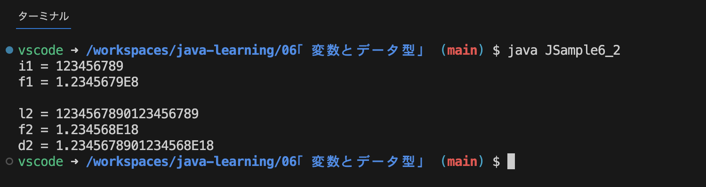
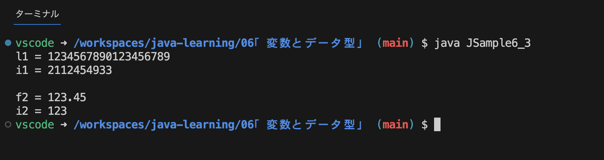

# 変数とデータ型

## 変数とは
Javaにおける変数は、値を一時的に保管しておくときの箱のようなもの。  
値を変数に保管しておくことで、別の場所で値を取り出して参照することができる。  

変数の箱には数値や文字列といった値そのものを格納するが、配列やクラスのインスタンスを変数に格納する場合はデータそのものが格納されるのではなく、データが格納されている場所が格納される。  

変数を利用するには最初に箱を用意する必要があり、これを`変数の宣言`と呼ぶ。  
```
int num;  //int型の値を保管する変数num
char c;   //char型の値を保管する変数c
```

変数に値を保管することを`変数に値を代入する`といい、次のように記述する。
```
num = 500;
c = 'あ';
```
`=`は等しいという意味ではなく、`=`の右辺にある値を左辺にある変数に代入するということを表している。

また、変数には値を何度でも代入できるが1つの値しか保管でないため、それまで保管していた値は参照できなくなる。  

## 変数名の付け方（識別子）
Javaでは変数やクラスを複数利用することができるので、それぞれを区別するために変数名やクラス名といった名前をつける。この名前のことを`識別子`と呼ぶ。  

### 変数名（識別子）のルール
クラス名にもいくつかルールがあったように変数名にもルールが存在する。

1. 変数名には`Unicode`に含まれる文字が使用できる  
2. 一文字目に数字は使用できない
3. 大文字と小文字は区別される
4. 予約語（Keywords）[^1]は使用できない
5. 文字数の制限はない

変数名にはアルファベットや数字、全角文字や日本語も使用可能で、記号は`_`と`$`のみ使用可能。  
予約後ではないが、`true` `false` `null`は使用できない。

## 基本のデータ型

### データ型の種類
Javaで用意されているデータ型は次のようなものがある。
| 型名 | 値 |
| --- | --- |
| boolean | `true` `false` |
| char | 16ビットUnicode文字 `\u0000`~`\uFFFF` |
| byte | 8ビット整数 `-128`~`127` |
| short | 16ビット整数 `-32,768`~`32,767` |
| int | 32ビット整数 `-2,147,483,648`~`2,147,483,647` |
| long | 64ビット整数 `-9,223,372,036,854,775,808`~`9,223,372,036,854,775,807` |
| float | 32ビット整数単制度浮動小数点数 |
| double | 16ビット整数倍制度浮動小数点数 |

byte型やshort型は扱える範囲がかなり狭く、また小さい数値の場合でもint型を使用した方が処理が高速に行えることから、基本的にint型を利用する。  
int型では扱えない極めて大きな数値を扱うことがわかっている場合にlong型を使用する。

## 変数宣言で型推論を利用する
Java10から`var`を使用することで変数の宣言時にデータ型の記述を省略することができる。

### varを使用した変数の宣言方法
Java10から`型推論`が利用可能になり、変数の宣言時に値を代入することで、代入される値からデータ型を決定する。  
型推論を使用する場合の書式は次の通り。
```
var 変数名 = 値;
```
初期化で代入される値からデータ型を決定するので、必ず変数の宣言時に初期化する必要がある。  
また、long型の変数やfloat型の変数を`var`を使用して宣言する場合は、初期化で代入する値にサフィックスをつけてデータ型を明確にする。
```
var num = 100;      //int型
var num = 10L;      //long型
var total = 3.14F;  //float型
```

**`var`を利用することでプログラムが簡素になるケースあれば、逆に分かりにくくなるケースもある。**  
**変数の宣言時にデータ型を記述するかを都度決めるのでなく、「どのような場面でvarを利用するか」などあらかじめルールを決めて統一した形で利用する事が大切。**

##　final変数の使い方
変数宣言の際、`final`をつけると変数を`定数`のように利用することができる。
```
final データ型 変数名 = 値;
```

また、一度値が代入された後に再代入を行うと、コンパイルエラーが発生する。
```
final int SPECIAL_POINT = 100;
SPECIAL_POINT = 150;  //コンパイルエラー
```
``

このように`final変数`には、値を代入できるのが一度だけという制約があるのであたかも`定数`のように利用することができる。  
なお、`final`をつけて変数を定数の様に利用する場合、**変数名はすべて大文字にし、単語はアンダーバーで繋げる名前の付け方**がよく行われる。

## キャスト演算子と型変換のルール

### 自動的な型変換（拡大変換）
通常は変数を宣言した時と異なる型のデータを代入することはできないが、`int`や`double`などの数値のデータ型は、扱う範囲が広いデータ型に対して扱う範囲が狭いデータ型の値を代入する場合はエラーにならない。
```
double d;
d = 100;  //エラーにならない（自動的にdouble型に変換）

// 逆にint型の変数にdouble型の値を代入するのはエラーとなる
int i;
i = 100.0;  //エラーとなる
```  
これはint型の値がdouble型に自動的に型変換が行われているからである。自動的な型変換のことを`拡大変換`とも言う。  
`拡大変換`は**扱う範囲が広いデータ型に対して扱う範囲が狭いデータ型の値を代入する場合に自動的に起こる。**  
扱える数値の範囲の大きさは、`double` > `float` > `long` > `int` > `short` > `byte`の順である。
```
float f = 10;     //OK（float型にint型の値を代入）
double d = 1234L; //OK（double型にlong型の値を代入）
```

もしint型の値にlong型やdouble型の値を代入しようとする場合は、**明示的に型変換を行うため**の`キャスト演算子`を使用しなければならない。（後述）

### intやlongからfloatやdoubleへ変換するときの注意点
float型やdouble型には`有効桁数`というものがあり、**float型は10進数でおよそ7桁（2進数で24桁）**で、**double型では10進数でおよそ16桁（2進数で53桁）**となっている。  

`有効桁数`とは**表示された数値の中で信頼できる値が何桁あるのか**ということであり、int型やlong型の値で7桁より大きい数値をfloat型の値に変換すると変換自体は行われるが、**7桁以降の数には誤差が生まれる可能性**がある。  
同じ様にdouble型の値に変換すると**15桁以降の数には誤差が生まれる可能性**がある。

拡大変換による値の誤差発生の例
```
class JSample6_2 {
  public static void main (String[] args) {
    int i1 = 123456789;
    float f1 = i1;    //int→floatに拡大変換

    System.out.println("i1 = " + i1);
    System.out.println("f1 = " + f1);

    System.out.println("");   //改行

    long l2 = 1234567890123456789L;
    float f2 = l2;    //long→floatに拡大変換
    double d2 = l2;   //long→doubleに拡大変換

    System.out.println("l2 = " + l2);
    System.out.println("f2 = " + f2);
    System.out.println("d2 = " + d2);
  }
}
```
実行結果

*`i1`と`f1`、`l2`と`f2`と`d2`の値にそれぞれ誤差が生じているのがわかる*

### キャスト演算子を使用した縮小変換
通常は扱う範囲が狭いデータ型に対して扱う範囲が広いデータ型の値を代入するとコンパイルエラーとなるが、`キャスト演算子`を利用して**明示的に型変換を行うことを記述**すれば代入することが可能となる。  
書式は次のとおり。
```
(データ型)変数
```

キャスト演算子による縮小変換の例
```
double d = 123.0;
int i = (int)d;       //キャスト演算子による縮小変換（double→int）
float f = (float)d;   //キャスト演算子による縮小変換（double→float）
```

### longからintやdoubleからintへ変換するときの注意点
キャスト演算子を使って扱う範囲が狭いデータ型に対して扱う範囲が広いデータ型の値を代入するとき、場合によっては入りきらない値を代入してしまう可能性がある。  
その場合の結果の例は次のとおり。
```
class JSample6_3 {
  public static void main (String[] args) {
    long l1 = 1234567890123456789L;
    int i1 = (int) l1;

    System.out.println("l1 = " + l1);
    System.out.println("i1 = " + i1);

    System.out.println("");   //改行

    float f2 = 123.45F;
    int i2 = (int) f2;

    System.out.println("f2 = " + f2);
    System.out.println("i2 = " + i2);
  }
}
```
実行結果

*`i1`の値は予測不能なものになり、`f2`の値は小数点以下が切り捨てられている。*

上記の様にキャスト演算子を使用して代入を行うとき、代入される値が代入する変数のデータ型の範囲を超えてしまう場合、予期せぬ結果になるので注意が必要。

### 数値リテラルを代入する場合の自動変換
数値リテラルを代入する場合に限り、自動的な変換になる場合がある。

```
short s = 10;   //OK（自動変換）
byte b = 10;    //OK（自動変換）
char c = 10;    //OK（自動変換）
```

数値リテラルで整数を記述した場合は int型の値となる。  
int型の値をshort型やbyte型の変数に代入する場合であっても、**数値リテラルを直接代入する場合**はキャスト演算子を使わなくてもそのまま代入することができる。


[^1]: あらかじめ用途が決められた単語のことで、それ以外の意味では使用することができない。一例として`byte`や`class`などが挙げられる。