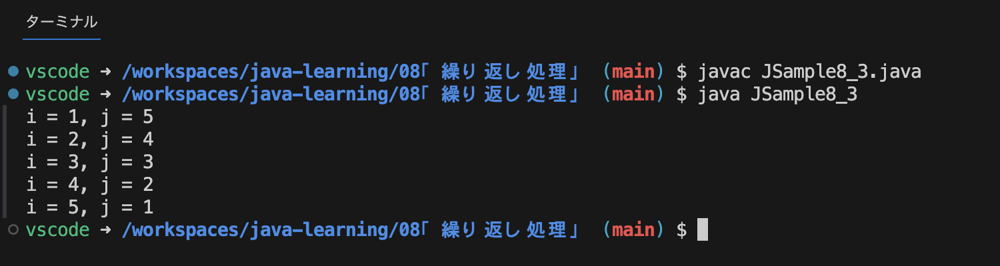

- [繰り返し処理](#繰り返し処理)
  - [for文](#for文)
    - [初期化式で宣言した変数のスコープ](#初期化式で宣言した変数のスコープ)
    - [初期化式・条件式・変化式を省略する](#初期化式条件式変化式を省略する)
    - [複数の初期化式と変化式を使用する](#複数の初期化式と変化式を使用する)

# 繰り返し処理
指定した回数や条件式が真となっている間、ブロック内の処理を繰り返し行う。  
Javaでは**for文**、**while文**、**do while文**、**拡張for文**が用意されている。

## for文
for文は**指定した回数だけ処理を繰り返すとき**に使用される。書式は次のとおり。
```
for (初期化式; 条件式; 変化式) {
  // 繰り返しの中で実行される処理
  ...
}
```
**初期化式**はfor文が実行されるときに最初の一度だけ実行される式。  
条件式で使用する変数の初期化などを主に行うが、それに限らない。  

繰り返し処理は条件式を評価してtrueだった場合には`{`から`}`のブロック内に記載された処理を上から順番に実行し、falseだった場合には繰り返し処理を終了しfor文の次の処理を映す。  

繰り返しが一度実行されてブロックの最後まで到達したら、変化式を一回評価する。  
この変化式で条件式で使用している変数の値を変換させる。そして改めて条件式を評価し、trueであれば再びブロック内の処理を行い、falseだった場合には繰り返し処理を終了する。

例
```
for (int i = 0; i < 3; i++) {
  System.out.println("i = " + i);
}
```
上記例のコードはそれぞれ`i = 0` `i = 1` `i = 2`を画面に出力する。

### 初期化式で宣言した変数のスコープ
for文の初期化式では変数に値を代入するだけでなく変数の宣言も行うことができるが、初期化式で宣言した変数のスコープ(使用できる範囲)はfor文のブロックだけ。

例
```
for (int i = 0; i < 2; i++) {
  System.out.println("i = " + i);
}

System.out.println(i);  // コンパイルエラー
```
もし、for文の中で使用する変数をfor文の外でも使用する場合には、変数の宣言をfor文の外よりも前に行うこと。
```
int i;

for (i = 0; i < 2; i++) {
  System.out.println("i = " + i);
}

System.out.println(i);  // 2
```

### 初期化式・条件式・変化式を省略する
for文で使用する初期化式、条件式、変化式は不要であればそれぞれ省略することができる。  

初期化式を省略した例
```
int i = 0;
for (; i < 2; i++) {
  System.out.println("i = " + i);
}
```

条件式を省略した例
```
int sum = 0;
for (int i = 1; ; i++) {
  sum += i;
  if (sum > 5) {
    break;  // breakが無いと無限ループになる
  }
}

System.out.println(sum);
```
条件式を省略した場合、条件式が常にtrueとして扱われるので、繰り返し処理が終わることができず無限ループとなる。  
この場合は繰り返し処理のブロックの中で、何かしらの条件を満たした場合に`break文`などを使って繰り返し処理を抜ける必要がある。

変化式を省略した例
```
int i = 1;

for (; i < 100;) {
  System.out.println(i);
  i *= 3;
}

System.out.println(i);
```
変化式を省略した場合も、繰り返し処理が一回終わるごとに何も変更が行われないので条件式の評価が同じままで無限ループになる可能性がある。  
この場合は、繰り返し処理の中で条件式の評価が変わるような処理を記述する必要がある。

初期化式、条件式、変化式を全て省略した例
```
int i = 1;
for (;;) {
  System.out.println(i);
  i *= 3;
  if (i > 100) {
    break;
  }
}
System.out.println(i);
```
このようにfor文の中で使用している初期化式、条件式、変化式については必要なければ省略が可能。

### 複数の初期化式と変化式を使用する
複数の指揮を記述する場合は式と式の間をカンマ`,`で区切って記述する。
```
for (初期化式1, 初期化式2; 条件式; 変化式1, 変化式2) {
  // 繰り返し処理の中で実行される処理
  ...
}
```
条件式は1つしか書くことができないが、関係演算子と論理演算子を組み合わせて複雑な条件式を設定することができる。

例
```
for (int i = 1, j = 5; i <= 5; i++, j--) {
  System.out.println("i = " + i + ", j = " + j);
}
```
実行結果


**なお初期化式では異なるデータ型の複数の変数を次のように記述することはできない**
```
for (int i = i, double d = 2.4; i <= 5; i++) {
  // エラー
}
```

**異なるデータ型の変数**を初期化式で初期化する場合は、for文の前で変数の宣言を行っておく必要がある。
```
int i;
double d;
for (i = 1, d = 2.4; i <= 5; i++) {
  // OK
}
```